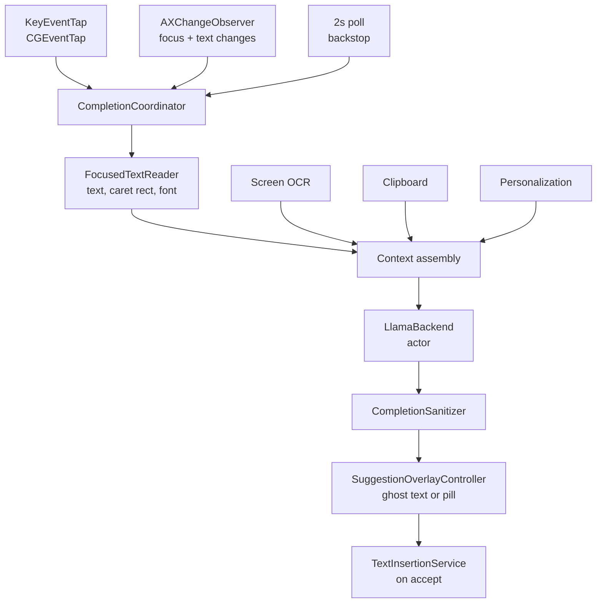

# How FreeTypist works

A map of the code for anyone changing it. The [README](../README.md) covers
using the app; this covers what happens between a keystroke and grey text
appearing in somebody else's window.

About 10,000 lines of Swift 6 in one process, over llama.cpp. No helper
daemon, no XPC service of its own, no inference process — the event tap, the
accessibility client, the model and the AppKit UI all live together.

---

## The shape of it

FreeTypist is an agent, not a windowed app. `LSUIElement` is true, so there is
no Dock icon: the surface is a menu-bar item, a settings window, and
borderless panels that float above whatever app you are typing in.

It is **not sandboxed**, and that one fact explains most of what follows. To
read the text you are typing in Mail and write a completion back into it, it
drives the macOS Accessibility API against other processes, which the App
Store sandbox forbids. So it ships Developer ID direct with its own Sparkle
updater rather than through the App Store.

The consequence worth keeping in mind while editing: one unsandboxed process
holds Accessibility rights over every app on the Mac *and* parses the update
feed, the model catalogue and multi-gigabyte GGUF files. There is no privilege
separation. Pinned checksums and a signed appcast reduce what can get in;
nothing reduces the blast radius once something has.

---

## Keystroke to suggestion

`CompletionCoordinator` is the loop and the largest file in the project. It
owns two debounces that set the whole feel of the app:

| Debounce | Value | Why |
| --- | --- | --- |
| Fast pass | 90 ms | Coalesces a burst of keystrokes, and absorbs duplicate AX notifications — Safari posts two `AXValueChanged` per keystroke plus a trailing `AXSelectedTextChanged`. |
| Model pass | 450 ms | Inference costs real time, so the model is only asked once typing actually pauses. |
| Poll | 2 s | A backstop, not the loop. It only has to catch what the tap and the observer cannot: permission changing, and apps that post no notifications at all. |

### Watching

Two independent signals, because neither is sufficient:

- **`KeyEventTap`** — a session `CGEventTap`. Unlike a passive monitor it can
  decide an event's fate, which is what makes Tab-to-accept possible at all.
- **`AXChangeObserver`** — subscribes to focus, value, selection, window move,
  resize, miniaturize, hide and deactivate notifications.
- **`HotKeyMonitor`** — Carbon `RegisterEventHotKey`. This exists because of
  *secure input*: while it is on, the window server stops delivering keys to
  session taps entirely, and the tap simply never fires again. Carbon hot keys
  are dispatched ahead of that gate. The two compose rather than race — a tap
  that consumes a key wins, and the hot key bound to it does not fire.

### Reading

`FocusedTextReader` returns the text either side of the caret, the caret's
screen rectangle, and the field's font and colour. Most apps answer through
character ranges; WebKit rich text answers only through
`AXTextMarker`/`AXTextMarkerRange`, which is `TextMarkerReader` and is what
makes Google Docs and Electron apps reachable.

It refuses in three cases, each for its own reason:

- **Secure input is on** (`SecureInput`) — something is collecting a password.
  Checked before any AX call. The `kAXSecureTextFieldSubrole` test below it
  only sees AppKit's own secure fields; a web login form, an Electron password
  box and a terminal at a `sudo` prompt carry no subrole and all turn secure
  input on.
- **A password field** — the subrole test, for the AppKit case.
- **A known-unsupported app** (`AppCompatibility`) — currently Ghostty, which
  reports the caret at position 0 wherever it really is and answers no bounds
  queries. Saying so is the feature: silence is indistinguishable from being
  broken.

---

## Generation

`LlamaBackend` is an actor wrapping llama.cpp. Four things make inference
affordable under a caret.

**Base checkpoints, not instruct.** The task is continuation — finish the
sentence someone started — and an instruction-tuned model keeps trying to
answer instead. Measured over ten prompts, every base checkpoint was both
cleaner and faster than the instruct one it replaced, and the `[topic]` /
`[Date]` placeholder failures disappeared entirely rather than becoming rarer.

**KV-cache prefix reuse.** Consecutive prompts share almost everything, so
only the diverging suffix is decoded. This is also why `CompletionPrompt` puts
`before` *last*: every other block holds still across keystrokes, so the
cached prefix survives. Reuse runs at 95–100% in normal typing.

**Token healing.** A tokenizer splits `" available"` into one token and
`" avail"` into another, so a prompt stopping mid-word stops on a token that
says the word is *finished* — and the model writes what follows the word
"avail". Before this, `avail` → `"ble"` ("availble"), `quest` → `"ons"`,
`docum` → `"net"`. The tokens spelling the current word are taken back off the
prompt and chosen again, restricted to the vocabulary that begins with the
bytes they stood for. How far to take back is decided before anything is
decoded, and it is the longest prefix that still has a candidate: one token
leaves `" doc"` standing, the whole word reaches `" resched"` which nothing
extends.

**Greedy with a repetition penalty.** Greedy keeps the same prefix yielding
the same suggestion, which matters under a caret — a suggestion that flickers
between renders is worse than none. Pure greedy collapses into loops, so a
mild penalty and a short-cycle detector sit on top. The personalization slider
is a logit bias on the word-initial token of each learned term.

`completions(_:count:)` returns a ranked list; `complete` is that with a count
of one, and the hot path uses it. Extra candidates forbid the openings already
used, so the prompt stays resident — three cost about 2.7× one, not 3×.
Candidates must also open on a different *word*, since `" busy"` and
`" b"+"usy"` are different tokens and the same thing to read.

---

## Showing it

Nothing can draw into another process's text view, so `SuggestionOverlayController`
puts a transparent, click-through `NSPanel` exactly at the caret and renders
the suggestion in the host field's own font and colour.

`Presentation.choose` picks between three forms from four facts, and is pure
so it can be tested without a live app:

- **inline** — ghost text at the caret. Only where the rest of the line is
  empty; the glyphs are opaque, so mid-line it would sit on top of the user's
  own words.
- **correction** — the typo struck through where it sits, the fix beside it.
- **pill** — a labelled chip below the caret, for mid-line suggestions and for
  apps that will not report caret geometry. It occludes, but it reads as a
  piece of UI rather than as text waiting to be accepted.

When several candidates exist, a small dimmed `2/3` follows the suggestion in
the *system* font — deliberately unlike the ghost text, because a counter that
looked insertable would be the worst thing to put at the end of text someone
is about to press Tab on.

Ghost text is only correct while the text under it has not moved, so the
overlay also follows scrolls (a passive `NSEvent` monitor), window drags,
space changes and display reconfiguration.

---

## Putting text in

`TextInsertionService` tries Accessibility first — atomic, invisible to undo
stacks, and synchronous, so the field is already up to date when it returns.
Apps that expose text read-only get synthesized `CGEvent` keystrokes instead,
which are posted and forgotten and arrive milliseconds later; the service
waits to be *told* the insertion landed rather than re-reading on a timer.

An app that refuses insertions three times is stood down for ten minutes.
Swallowing Tab is a promise to put something in its place, and a broken Tab
key is far worse than a missing suggestion.

---

## What is on disk

| Path | Holds |
| --- | --- |
| `~/Library/Application Support/FreeTypist/Models/*.gguf` | Downloaded models, verified against a pinned SHA-256 on arrival |
| `~/Library/Application Support/FreeTypist/personalization.sqlite` | The personalization store: snippets sealed with AES-GCM, vocabulary addressed by HMAC |
| `~/Library/Preferences/com.freetypist.app.plist` | Settings, excluded apps, per-app overrides, statistics |
| Keychain | The AES key for the personalization store |

Personalization is off by default and gated three ways before anything is
written: recording is on, the app is not excluded, and either a completion was
accepted there or the user opted into recording regardless. Text FreeTypist
itself inserted is tracked separately so it is never learned back as the
user's own vocabulary. The store is bounded at 2,000 snippets of 600
characters.

---

## Permissions

| Permission | For | Required |
| --- | --- | --- |
| Accessibility | Reading and writing other apps' text fields | Yes — nothing works without it |
| Screen Recording | Screen text as context, and sampling the colour behind the caret | No |

`SystemSettings` holds the deep links. The Screen Recording one matters:
`CGRequestScreenCaptureAccess` shows its prompt once per app identity and
silently does nothing ever after, so a button wired only to it stops working
the moment someone clicks Deny.

---

## Building and releasing

`xcodegen` generates the project from `project.yml`, so a new source file is
picked up by regenerating rather than by editing a `.pbxproj`.

- `scripts/install.sh` — build, install to `/Applications`, sign. macOS grants
  Accessibility to a *code identity*, so an ad-hoc build loses permission on
  every rebuild; signing with a real certificate keeps it.
- `scripts/release.sh` — version, build, sign, notarize, archive, sign the
  archive for Sparkle, add an appcast item. It refuses to proceed unless the
  public key is present, a private key exists, the two *match*, and the
  signature verifies against the archive it will upload.
- `scripts/generate-update-keys.sh` — once ever. Losing the private key means
  no existing install can ever be updated again.

---

## Tests

`./scripts/test.sh`. Two kinds:

**Pure logic**, compiled file by file with `swiftc`, no Xcode project and no
app launch. These cover the rules that were established by measuring real
model output — sanitizing, word boundaries, prompt assembly, the presentation
rule, exclusions and overrides, the latency window, crash-report matching.

**Engine tests**, which need a model on disk and are skipped without one: the
word-choice bias, token healing, ranked alternatives, and KV-cache reuse.
These assert behaviour against the real model rather than a stub — token
healing checks that every fragment joins into a correctly spelled word.

`set -o pipefail` is on deliberately. Without it a crash is invisible whenever
a test's output is piped into `grep`, because `set -e` sees grep's status and
never the binary's — which is exactly how one test aborted in ggml's `atexit`
handler for weeks without anyone noticing.
